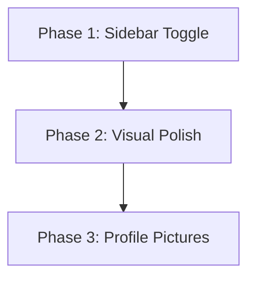

# MedyxHMS — UI/UX Enhancement Roadmap

> **Status**: Planning | **Date**: 2026-06-24 | **Branch**: main  
> **Principle**: Incremental, safe, backward-compatible — zero breakage to existing functionality.

---

## Overview

This document outlines a phased, stage-by-stage plan for implementing 3 UI/UX enhancements on the MedyxHMS ASP.NET Core 8 MVC system. Each phase is designed to be independently testable, with fallback strategies for every step.

| Phase | Feature | Risk Level | Estimated Effort |
|-------|---------|------------|-----------------|
| 1 | Sidebar Toggle (Collapse/Expand) | 🟢 Low | 2–3 hours |
| 2 | Visual Design Polish (Icons, Cards, Consistency) | 🟢 Low | 3–4 hours |
| 3 | User Profile Pictures | 🟡 Medium | 4–5 hours |

---

## Current Architecture Reference

| Concern | Technology / Location |
|---------|----------------------|
| Layout | `Views/Shared/_Layout.cshtml` |
| Sidebar | `Views/Shared/Components/SidebarNav/Default.cshtml` |
| Sidebar logic | `Components/SidebarNavViewComponent.cs` |
| User model | `Models/ApplicationUser.cs` (already has `ProfileImage`) |
| Identity | ASP.NET Core Identity via `ApplicationUser : IdentityUser` |
| Icons | Font Awesome 6.5.2 (already included) |
| CSS | `wwwroot/css/site.css`, `wwwroot/css/mobile-friendly.css` |
| Theme | Custom theme system at `/SystemManagement/ThemeStylesheet` |
| Toggle button | Already exists in navbar (`#sidebar-toggle-btn`, d-lg-none) |

---

## Phase 1 · Sidebar Toggle (Collapse/Expand)

> **Risk**: 🟢 Low — CSS/JS only, no backend changes.

### Stage 1.1 — Audit Current State

**What exists today:**
- A toggle button `#sidebar-toggle-btn` already exists in `_Layout.cshtml` navbar
- It only shows on mobile (`d-lg-none`)
- Font Awesome `fa-bars` icon is already present
- The sidebar is rendered by `SidebarNavViewComponent` → `Default.cshtml`

**File:** `Views/Shared/_Layout.cshtml` (lines 23–30)
```html
<button id="sidebar-toggle-btn"
        class="btn btn-sm btn-outline-secondary me-2 d-lg-none"
        type="button"
        title="Toggle sidebar"
        aria-label="Toggle sidebar">
    <i class="fas fa-bars"></i>
</button>
```

### Stage 1.2 — Plan: Extend Toggle to Desktop

**What will change:**

| File | Change |
|------|--------|
| `wwwroot/css/site.css` | Add `.sidebar-collapsed` CSS rules for desktop |
| `Views/Shared/_Layout.cshtml` | Remove `d-lg-none` from toggle button |
| `wwwroot/js/sidebar-toggle.js` | **New file** — JavaScript toggle logic with localStorage |

**What will NOT change:**
- Sidebar HTML structure (menu items, role checks, module visibility)
- `SidebarNavViewComponent.cs` logic
- Any controller or service code

### Stage 1.3 — Implementation Steps

#### Step 1: Create `wwwroot/js/sidebar-toggle.js`

```javascript
// MedyxHMS — Sidebar toggle with localStorage persistence
(function () {
    const STORAGE_KEY = 'medyx-sidebar-collapsed';
    const sidebar = document.getElementById('staff-sidebar');
    const toggleBtn = document.getElementById('sidebar-toggle-btn');

    if (!sidebar || !toggleBtn) return;

    // Restore state on load
    const isCollapsed = localStorage.getItem(STORAGE_KEY) === 'true';
    if (isCollapsed) {
        sidebar.classList.add('sidebar-collapsed');
        toggleBtn.querySelector('i').classList.replace('fa-bars', 'fa-chevron-right');
    }

    toggleBtn.addEventListener('click', function () {
        const collapsed = sidebar.classList.toggle('sidebar-collapsed');
        localStorage.setItem(STORAGE_KEY, collapsed);
        const icon = toggleBtn.querySelector('i');
        if (collapsed) {
            icon.classList.replace('fa-bars', 'fa-chevron-right');
        } else {
            icon.classList.replace('fa-chevron-right', 'fa-bars');
        }
    });
})();
```

#### Step 2: Add CSS to `wwwroot/css/site.css`

```css
/* ─── Sidebar Toggle ─── */
#staff-sidebar {
    transition: width 0.25s ease, opacity 0.25s ease;
    overflow: hidden;
}

#staff-sidebar.sidebar-collapsed {
    width: 56px;
}

#staff-sidebar.sidebar-collapsed .staff-sidebar-link span,
#staff-sidebar.sidebar-collapsed .staff-sidebar-sublink,
#staff-sidebar.sidebar-collapsed .staff-sidebar-chevron,
#staff-sidebar.sidebar-collapsed .staff-sidebar-section,
#staff-sidebar.sidebar-collapsed .staff-sidebar-header span,
#staff-sidebar.sidebar-collapsed .collapse {
    display: none !important;
}

#staff-sidebar.sidebar-collapsed .staff-sidebar-icon {
    margin-right: 0;
    text-align: center;
    width: 100%;
}

/* On mobile: toggle button always visible, sidebar overlays */
@media (max-width: 991.98px) {
    #staff-sidebar {
        position: fixed;
        left: 0;
        top: 56px;
        bottom: 0;
        z-index: 1040;
        width: 250px;
        transform: translateX(-100%);
        transition: transform 0.25s ease;
    }

    #staff-sidebar:not(.sidebar-collapsed) {
        transform: translateX(0);
    }

    #staff-sidebar.sidebar-collapsed {
        transform: translateX(-100%);
        width: 250px;  /* keep original width for animation */
    }
}
```

#### Step 3: Update `_Layout.cshtml`

**Change the toggle button** — remove `d-lg-none`:
```html
<button id="sidebar-toggle-btn"
        class="btn btn-sm btn-outline-secondary me-2"
        type="button"
        title="Toggle sidebar"
        aria-label="Toggle sidebar">
    <i class="fas fa-bars"></i>
</button>
```

**Add script reference** before `</body>`:
```html
<script src="~/js/sidebar-toggle.js" asp-append-version="true"></script>
```

#### Step 4: Add `id="staff-sidebar"` to sidebar container

In `Views/Shared/Components/SidebarNav/Default.cshtml`, wrap the sidebar content in a div:
```html
<div id="staff-sidebar" class="staff-sidebar d-flex flex-column">
    <!-- existing sidebar content unchanged -->
</div>
```

> **If the sidebar is rendered inline in `_Layout.cshtml`**, check the render location and wrap accordingly.

### Stage 1.4 — Verification Checklist

- [ ] Toggle button visible on desktop AND mobile
- [ ] Clicking collapses sidebar to icon-only (56px)
- [ ] Clicking again expands to full width
- [ ] State persists across page reloads (localStorage)
- [ ] All menu links still work when collapsed
- [ ] Role-based menu items still hidden when collapsed
- [ ] Mobile overlay behavior works correctly

### Stage 1.5 — Risk Mitigation

| Risk | Mitigation |
|------|-----------|
| CSS selector conflicts with theme | Use specific `#staff-sidebar` ID selector |
| JS error breaks page | Wrapped in IIFE with null checks |
| localStorage unavailable | Falls back gracefully (default: expanded) |

---

## Phase 2 · Visual Design Polish

> **Risk**: 🟢 Low — CSS-only and HTML class additions, no backend changes.

### Stage 2.1 — Dashboard Cards Enhancement

**Current state:** Dashboard views use standard Bootstrap cards. Improvements needed for consistency.

**What will change:**

| File | Change |
|------|--------|
| `Views/Dashboard/Index.cshtml` | Add icon headers to stat cards, consistent card structure |
| `Views/Shared/_Layout.cshtml` | Add sidebar icon mapping (already has Font Awesome) |

**Safe approach — add icon mapping for existing dashboard stats:**

Each dashboard stat card gets a Font Awesome icon before the number:
```html
<!-- Before -->
<div class="card">
    <div class="card-body">
        <h3>@Model.TotalPatients</h3>
        <p>Total Patients</p>
    </div>
</div>

<!-- After -->
<div class="card border-0 shadow-sm">
    <div class="card-body d-flex align-items-center gap-3">
        <div class="rounded-circle bg-primary bg-opacity-10 p-3">
            <i class="fas fa-users fa-2x text-primary"></i>
        </div>
        <div>
            <h4 class="mb-0 fw-bold">@Model.TotalPatients</h4>
            <p class="text-muted mb-0 small">Total Patients</p>
        </div>
    </div>
</div>
```

### Stage 2.2 — Table Styling Standardization

**Apply globally via `site.css`** (no per-view changes needed):

```css
/* ─── Table Enhancements ─── */
.table {
    border-radius: 0.5rem;
    overflow: hidden;
}

.table thead th {
    background-color: #f8fafc;
    border-bottom: 2px solid #e5e7eb;
    font-weight: 600;
    text-transform: uppercase;
    font-size: 0.8rem;
    letter-spacing: 0.05em;
    color: #64748b;
}

.table-hover tbody tr:hover {
    background-color: #f1f5f9;
}
```

### Stage 2.3 — Form Layout Standardization

**Add to `site.css`** for consistent form spacing:

```css
/* ─── Form Enhancements ─── */
.form-container {
    max-width: 900px;
}

.form-floating > .form-control:focus ~ label,
.form-floating > .form-control:not(:placeholder-shown) ~ label {
    color: var(--hms-primary);
}

.card .form-floating:last-child {
    margin-bottom: 0;
}
```

### Stage 2.4 — Button Consistency

**Standardize button usage across views** (spot fixes per view):

| Context | Button Class |
|---------|-------------|
| Primary action | `btn btn-primary` |
| Save/Submit | `btn btn-success` |
| Cancel/Back | `btn btn-outline-secondary` |
| Delete/Danger | `btn btn-danger` |
| Info/Details | `btn btn-info` |

**Add icon prefixes to common buttons** (update views incrementally):
```html
<button type="submit" class="btn btn-success">
    <i class="fas fa-save me-1"></i> Save
</button>
<a asp-action="Index" class="btn btn-outline-secondary">
    <i class="fas fa-arrow-left me-1"></i> Back
</a>
```

### Stage 2.5 — Sidebar Visual Polish

**Add to `site.css`** (sidebar already has `staff-sidebar-*` classes):

```css
/* ─── Sidebar Polish ─── */
.staff-sidebar-link {
    transition: background-color 0.15s ease, color 0.15s ease;
    border-radius: 0.375rem;
    margin: 0 0.5rem;
}

.staff-sidebar-link:hover {
    background-color: rgba(255, 255, 255, 0.08);
}

.staff-sidebar-link.active {
    background-color: rgba(255, 255, 255, 0.15);
    font-weight: 600;
}

.staff-sidebar-sublink {
    transition: color 0.15s ease;
}
```

### Stage 2.6 — Verification Checklist

- [ ] Dashboard cards have icons and consistent spacing
- [ ] All tables have striped/hover styling
- [ ] Forms have uniform spacing and floating labels where appropriate
- [ ] Buttons have consistent color conventions
- [ ] No broken layouts or form bindings
- [ ] Mobile responsive still works

### Stage 2.7 — Risk Mitigation

| Risk | Mitigation |
|------|-----------|
| CSS changes break theme system | Only add rules, never remove existing ones |
| Button class changes break JS | Only add icon `<i>` elements, don't change button `type` or `name` |
| Table styling hides data | Use `overflow-x: auto` on table containers |

---

## Phase 3 · User Profile Pictures

> **Risk**: 🟡 Medium — Involves file I/O, security validation, and model changes.

### Stage 3.1 — Audit: Current State

**`Models/ApplicationUser.cs`** already has the field:
```csharp
public string? ProfileImage { get; set; }
```

✅ **No model migration needed.** The column already exists in the database.

**Existing profile display:** Check `_Layout.cshtml` — there may already be a profile image display in the navbar user dropdown.

### Stage 3.2 — Backend: File Upload Service

**New file:** `Services/Interfaces/IProfileImageService.cs`
```csharp
namespace MedyxHMS.Services.Interfaces
{
    public interface IProfileImageService
    {
        Task<string?> UploadAsync(string userId, IFormFile file);
        Task<bool> DeleteAsync(string userId);
        string GetDisplayPath(string? profileImage);
    }
}
```

**New file:** `Services/Implementations/ProfileImageService.cs`
```csharp
using MedyxHMS.Services.Interfaces;

namespace MedyxHMS.Services.Implementations
{
    public class ProfileImageService : IProfileImageService
    {
        private readonly IWebHostEnvironment _env;
        private readonly ILogger<ProfileImageService> _logger;

        private static readonly HashSet<string> AllowedExtensions = new(
            StringComparer.OrdinalIgnoreCase) { ".jpg", ".jpeg", ".png" };

        private const long MaxFileSize = 2 * 1024 * 1024; // 2 MB

        public ProfileImageService(IWebHostEnvironment env, ILogger<ProfileImageService> logger)
        {
            _env = env;
            _logger = logger;
        }

        public async Task<string?> UploadAsync(string userId, IFormFile file)
        {
            if (file == null || file.Length == 0) return null;
            if (file.Length > MaxFileSize)
                throw new InvalidOperationException("File exceeds 2 MB limit.");

            var ext = Path.GetExtension(file.FileName);
            if (!AllowedExtensions.Contains(ext))
                throw new InvalidOperationException("Only JPG and PNG files are allowed.");

            var uploadsDir = Path.Combine(_env.WebRootPath, "uploads", "profile");
            Directory.CreateDirectory(uploadsDir);

            // Delete old image if exists
            await DeleteAsync(userId);

            var fileName = $"{userId}_{Guid.NewGuid():N}{ext}";
            var filePath = Path.Combine(uploadsDir, fileName);

            await using var stream = new FileStream(filePath, FileMode.Create);
            await file.CopyToAsync(stream);

            _logger.LogInformation("Profile image uploaded for user {UserId}", userId);
            return fileName;
        }

        public Task<bool> DeleteAsync(string userId)
        {
            var uploadsDir = Path.Combine(_env.WebRootPath, "uploads", "profile");
            if (!Directory.Exists(uploadsDir)) return Task.FromResult(false);

            var existing = Directory.GetFiles(uploadsDir, $"{userId}_*");
            foreach (var f in existing)
            {
                File.Delete(f);
            }

            return Task.FromResult(existing.Length > 0);
        }

        public string GetDisplayPath(string? profileImage)
        {
            if (string.IsNullOrWhiteSpace(profileImage))
                return "/images/default-avatar.png";
            return $"/uploads/profile/{profileImage}";
        }
    }
}
```

### Stage 3.3 — DI Registration

**In `Program.cs`**, add:
```csharp
builder.Services.AddScoped<IProfileImageService, ProfileImageService>();
```

✅ Add alongside existing service registrations (around line 68–95).

### Stage 3.4 — Account Controller: Upload Endpoint

**File:** `Controllers/AccountController.cs`

Add new action (do NOT modify existing actions):
```csharp
[HttpPost]
[Authorize]
[ValidateAntiForgeryToken]
public async Task<IActionResult> UploadProfileImage(IFormFile profileImage)
{
    var userId = _userManager.GetUserId(User);
    if (string.IsNullOrEmpty(userId)) return RedirectToAction("Login");

    try
    {
        var profileService = HttpContext.RequestServices.GetRequiredService<IProfileImageService>();
        var fileName = await profileService.UploadAsync(userId, profileImage);

        var user = await _userManager.FindByIdAsync(userId);
        if (user != null)
        {
            user.ProfileImage = fileName;
            await _userManager.UpdateAsync(user);
        }

        await _auditService.LogActivityAsync(userId, "PROFILE_IMAGE_UPLOAD", "User", userId);
        TempData["SuccessMessage"] = "Profile picture updated.";
    }
    catch (InvalidOperationException ex)
    {
        ModelState.AddModelError("profileImage", ex.Message);
    }

    return RedirectToAction("Profile");
}
```

Add delete action:
```csharp
[HttpPost]
[Authorize]
[ValidateAntiForgeryToken]
public async Task<IActionResult> DeleteProfileImage()
{
    var userId = _userManager.GetUserId(User);
    if (string.IsNullOrEmpty(userId)) return RedirectToAction("Login");

    var profileService = HttpContext.RequestServices.GetRequiredService<IProfileImageService>();
    await profileService.DeleteAsync(userId);

    var user = await _userManager.FindByIdAsync(userId);
    if (user != null)
    {
        user.ProfileImage = null;
        await _userManager.UpdateAsync(user);
    }

    await _auditService.LogActivityAsync(userId, "PROFILE_IMAGE_DELETE", "User", userId);
    return RedirectToAction("Profile");
}
```

### Stage 3.5 — Profile Page: Upload UI

**File:** `Views/Account/Profile.cshtml`

Add upload form section (append, don't modify existing):
```html
<div class="card mb-4">
    <div class="card-header">
        <h5 class="mb-0"><i class="fas fa-camera me-2"></i>Profile Picture</h5>
    </div>
    <div class="card-body">
        <div class="row align-items-center">
            <div class="col-md-3 text-center">
                @{
                    var profileService = Context.RequestServices.GetService<MedyxHMS.Services.Interfaces.IProfileImageService>();
                    var imgPath = profileService?.GetDisplayPath(Model.ProfileImage) ?? "/images/default-avatar.png";
                }
                
            </div>
            <div class="col-md-9">
                <form asp-action="UploadProfileImage" method="post" enctype="multipart/form-data">
                    @Html.AntiForgeryToken()
                    <div class="mb-3">
                        <label for="profileImage" class="form-label">Choose image (JPG/PNG, max 2MB)</label>
                        <input type="file" class="form-control" id="profileImage"
                               name="profileImage" accept=".jpg,.jpeg,.png" />
                        <div class="form-text">Square images work best. Max 2 MB.</div>
                    </div>
                    <button type="submit" class="btn btn-primary">
                        <i class="fas fa-upload me-1"></i> Upload
                    </button>
                    @if (!string.IsNullOrEmpty(Model.ProfileImage))
                    {
                        <button type="submit" class="btn btn-outline-danger ms-2"
                                formaction="/Account/DeleteProfileImage">
                            <i class="fas fa-trash me-1"></i> Remove
                        </button>
                    }
                </form>
            </div>
        </div>
    </div>
</div>
```

### Stage 3.6 — Navbar: Display Profile Image

**File:** `Views/Shared/_Layout.cshtml`

Update the user dropdown in the navbar (the `<ul class="navbar-nav ms-auto">` section):
```html
@{
    var userIdNav = User.FindFirst(System.Security.Claims.ClaimTypes.NameIdentifier)?.Value;
    var profileImgPath = "/images/default-avatar.png";
    if (!string.IsNullOrEmpty(userIdNav))
    {
        var navProfileService = Context.RequestServices.GetService<MedyxHMS.Services.Interfaces.IProfileImageService>();
        // Get current user's profile image — lightweight query
    }
}
```

> **Safe approach for navbar:** Create a `ProfileImageViewComponent` that returns just the image path, avoiding service location in the layout.

**New file:** `Components/ProfileImageViewComponent.cs`
```csharp
using MedyxHMS.Services.Interfaces;
using Microsoft.AspNetCore.Mvc;
using System.Security.Claims;

namespace MedyxHMS.Components
{
    public class ProfileImageViewComponent : ViewComponent
    {
        private readonly IProfileImageService _profileImageService;

        public ProfileImageViewComponent(IProfileImageService profileImageService)
        {
            _profileImageService = profileImageService;
        }

        public IViewComponentResult Invoke()
        {
            var userId = HttpContext.User.FindFirstValue(ClaimTypes.NameIdentifier);
            // Get the image path from the current user's profile
            // The layout can pass the ProfileImage value in ViewData
            var profileImage = ViewData["CurrentUserProfileImage"] as string;
            var path = _profileImageService.GetDisplayPath(profileImage);
            return View("Default", path);
        }
    }
}
```

**New file:** `Views/Shared/Components/ProfileImage/Default.cshtml`
```html
@model string

```

### Stage 3.7 — Default Avatar

Place a default avatar image at `wwwroot/images/default-avatar.png`. Use a simple SVG placeholder or a generic icon-based avatar.

### Stage 3.8 — Verification Checklist

- [ ] Profile page shows upload form with current image preview
- [ ] Upload validates file type (JPG/PNG only)
- [ ] Upload validates file size (≤ 2MB)
- [ ] Upload generates GUID-based filename (no path traversal)
- [ ] Old image is deleted on new upload
- [ ] Remove button works and clears the image
- [ ] Navbar shows profile picture (or default avatar)
- [ ] Audit log records upload/delete actions
- [ ] RBAC unaffected — any authenticated user can upload their own picture

### Stage 3.9 — Risk Mitigation

| Risk | Mitigation |
|------|-----------|
| File path traversal | GUID filename, no user input in path |
| Executable upload | Extension whitelist (.jpg/.jpeg/.png only) |
| Disk space exhaustion | 2 MB limit per file, old files deleted on replace |
| Broken Identity | No changes to `ApplicationUser` model (field already exists) |
| Missing directory | `Directory.CreateDirectory()` called before write |

---

## Phase Dependencies



Phases are independent and can be tested in isolation. Phase 1 is recommended first because the sidebar toggle CSS/JS establishes the pattern for safe, incremental changes.

---

## Global Safety Checklist (All Phases)

- [ ] No controller action signatures changed
- [ ] No Razor binding names or form field `name` attributes changed
- [ ] No `[Authorize]` attributes removed or weakened
- [ ] No audit logging removed or skipped
- [ ] No EF Core migrations needed (Phase 3 uses existing `ProfileImage` column)
- [ ] All new files use existing namespace conventions
- [ ] CSS additions only — no existing rules removed
- [ ] JavaScript wrapped in IIFE with null guards

---

## Rollback Plan

For each phase, if issues are found:

| Phase | Rollback |
|-------|---------|
| Phase 1 | Remove `<script>` tag, remove CSS additions, restore `d-lg-none` on toggle button |
| Phase 2 | Revert `site.css` to previous commit |
| Phase 3 | Remove service registration, remove upload actions, remove ViewComponent — existing `ProfileImage` column can remain unset |
