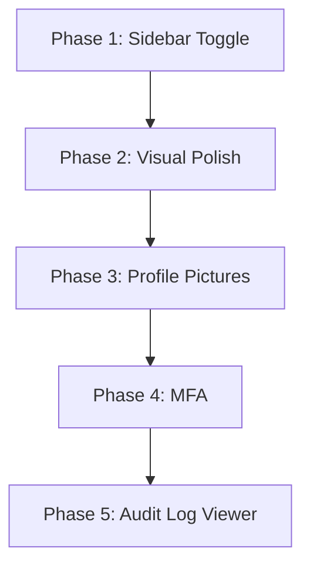

# MedyxHMS — UI/UX Enhancement Roadmap

> **Status**: Planning | **Date**: 2026-06-24 | **Branch**: main  
> **Principle**: Incremental, safe, backward-compatible — zero breakage to existing functionality.

---

## Overview

This document outlines a phased, stage-by-stage plan for implementing 5 enhancements on the MedyxHMS ASP.NET Core 8 MVC system. Each phase is designed to be independently testable, with fallback strategies for every step.

| Phase | Feature | Risk Level | Estimated Effort |
|-------|---------|------------|-----------------|
| 1 | Sidebar Toggle (Collapse/Expand) | 🟢 Low | 2–3 hours |
| 2 | Visual Design Polish (Icons, Cards, Consistency) | 🟢 Low | 3–4 hours |
| 3 | User Profile Pictures | 🟡 Medium | 4–5 hours |
| 4 | Multi-Factor Authentication (MFA) | 🔴 High | 6–8 hours |
| 5 | Audit Log Menu & Viewer | 🟢 Low | 3–4 hours | ✅ Complete |

### Documentation Update Rule

After **EVERY phase completion**, update the following 5 documentation files to keep them in sync with the implemented changes:

| Doc File | Update After Phase |
|----------|-------------------|
| `docs/PRD.md` | Add/update feature description for the completed phase |
| `docs/Function_List.md` | Add new controller actions, service interfaces, implementations |
| `docs/Functionality.md` | Add detailed functionality section for the new feature |
| `docs/Modules.md` | Add new module entry if the feature introduces a module |
| `docs/Sidebar.md` | Add new sidebar items with URLs, icons, and role gates |

> ⚠️ **Do NOT defer documentation updates to the end.** Each phase's summary includes a specific "Documentation Updates Required" checklist — complete it before starting the next phase.

---

## Current Architecture Reference

| Concern | Technology / Location |
|---------|----------------------|
| Layout | `Views/Shared/_Layout.cshtml` |
| Sidebar | `Views/Shared/Components/SidebarNav/Default.cshtml` |
| Sidebar logic | `Components/SidebarNavViewComponent.cs` |
| User model | `Models/ApplicationUser.cs` (already has `ProfileImage`) |
| Identity | ASP.NET Core Identity via `ApplicationUser : IdentityUser` |
| Icons | Font Awesome 6.5.2 (already included) |
| CSS | `wwwroot/css/site.css`, `wwwroot/css/mobile-friendly.css` |
| Theme | Custom theme system at `/SystemManagement/ThemeStylesheet` |
| Toggle button | Already exists in navbar (`#sidebar-toggle-btn`, d-lg-none) |

---

## Phase 1 · Sidebar Toggle (Collapse/Expand)

> **Risk**: 🟢 Low — CSS/JS only, no backend changes.

### Stage 1.1 — Audit Current State

**What exists today:**
- A toggle button `#sidebar-toggle-btn` already exists in `_Layout.cshtml` navbar
- It only shows on mobile (`d-lg-none`)
- Font Awesome `fa-bars` icon is already present
- The sidebar is rendered by `SidebarNavViewComponent` → `Default.cshtml`

**File:** `Views/Shared/_Layout.cshtml` (lines 23–30)
```html
<button id="sidebar-toggle-btn"
        class="btn btn-sm btn-outline-secondary me-2 d-lg-none"
        type="button"
        title="Toggle sidebar"
        aria-label="Toggle sidebar">
    <i class="fas fa-bars"></i>
</button>
```

### Stage 1.2 — Plan: Extend Toggle to Desktop

**What will change:**

| File | Change |
|------|--------|
| `wwwroot/css/site.css` | Add `.sidebar-collapsed` CSS rules for desktop |
| `Views/Shared/_Layout.cshtml` | Remove `d-lg-none` from toggle button |
| `wwwroot/js/sidebar-toggle.js` | **New file** — JavaScript toggle logic with localStorage |

**What will NOT change:**
- Sidebar HTML structure (menu items, role checks, module visibility)
- `SidebarNavViewComponent.cs` logic
- Any controller or service code

### Stage 1.3 — Implementation Steps

#### Step 1: Create `wwwroot/js/sidebar-toggle.js`

```javascript
// MedyxHMS — Sidebar toggle with localStorage persistence
(function () {
    const STORAGE_KEY = 'medyx-sidebar-collapsed';
    const sidebar = document.getElementById('staff-sidebar');
    const toggleBtn = document.getElementById('sidebar-toggle-btn');

    if (!sidebar || !toggleBtn) return;

    // Restore state on load
    const isCollapsed = localStorage.getItem(STORAGE_KEY) === 'true';
    if (isCollapsed) {
        sidebar.classList.add('sidebar-collapsed');
        toggleBtn.querySelector('i').classList.replace('fa-bars', 'fa-chevron-right');
    }

    toggleBtn.addEventListener('click', function () {
        const collapsed = sidebar.classList.toggle('sidebar-collapsed');
        localStorage.setItem(STORAGE_KEY, collapsed);
        const icon = toggleBtn.querySelector('i');
        if (collapsed) {
            icon.classList.replace('fa-bars', 'fa-chevron-right');
        } else {
            icon.classList.replace('fa-chevron-right', 'fa-bars');
        }
    });
})();
```

#### Step 2: Add CSS to `wwwroot/css/site.css`

```css
/* ─── Sidebar Toggle ─── */
#staff-sidebar {
    transition: width 0.25s ease, opacity 0.25s ease;
    overflow: hidden;
}

#staff-sidebar.sidebar-collapsed {
    width: 56px;
}

#staff-sidebar.sidebar-collapsed .staff-sidebar-link span,
#staff-sidebar.sidebar-collapsed .staff-sidebar-sublink,
#staff-sidebar.sidebar-collapsed .staff-sidebar-chevron,
#staff-sidebar.sidebar-collapsed .staff-sidebar-section,
#staff-sidebar.sidebar-collapsed .staff-sidebar-header span,
#staff-sidebar.sidebar-collapsed .collapse {
    display: none !important;
}

#staff-sidebar.sidebar-collapsed .staff-sidebar-icon {
    margin-right: 0;
    text-align: center;
    width: 100%;
}

/* On mobile: toggle button always visible, sidebar overlays */
@media (max-width: 991.98px) {
    #staff-sidebar {
        position: fixed;
        left: 0;
        top: 56px;
        bottom: 0;
        z-index: 1040;
        width: 250px;
        transform: translateX(-100%);
        transition: transform 0.25s ease;
    }

    #staff-sidebar:not(.sidebar-collapsed) {
        transform: translateX(0);
    }

    #staff-sidebar.sidebar-collapsed {
        transform: translateX(-100%);
        width: 250px;  /* keep original width for animation */
    }
}
```

#### Step 3: Update `_Layout.cshtml`

**Change the toggle button** — remove `d-lg-none`:
```html
<button id="sidebar-toggle-btn"
        class="btn btn-sm btn-outline-secondary me-2"
        type="button"
        title="Toggle sidebar"
        aria-label="Toggle sidebar">
    <i class="fas fa-bars"></i>
</button>
```

**Add script reference** before `</body>`:
```html
<script src="~/js/sidebar-toggle.js" asp-append-version="true"></script>
```

#### Step 4: Add `id="staff-sidebar"` to sidebar container

In `Views/Shared/Components/SidebarNav/Default.cshtml`, wrap the sidebar content in a div:
```html
<div id="staff-sidebar" class="staff-sidebar d-flex flex-column">
    <!-- existing sidebar content unchanged -->
</div>
```

> **If the sidebar is rendered inline in `_Layout.cshtml`**, check the render location and wrap accordingly.

### Stage 1.4 — Verification Checklist

- [ ] Toggle button visible on desktop AND mobile
- [ ] Clicking collapses sidebar to icon-only (56px)
- [ ] Clicking again expands to full width
- [ ] State persists across page reloads (localStorage)
- [ ] All menu links still work when collapsed
- [ ] Role-based menu items still hidden when collapsed
- [ ] Mobile overlay behavior works correctly

### Stage 1.5 — Risk Mitigation

| Risk | Mitigation |
|------|-----------|
| CSS selector conflicts with theme | Use specific `#staff-sidebar` ID selector |
| JS error breaks page | Wrapped in IIFE with null checks |
| localStorage unavailable | Falls back gracefully (default: expanded) |

---

## Phase 1 · Implementation & Validation Summary

### Files Created

| File | Purpose |
|------|---------|
| `wwwroot/js/sidebar-toggle.js` | Sidebar collapse/expand with localStorage persistence |

### Files Modified

| File | Change |
|------|--------|
| `wwwroot/css/site.css` | Added `.sidebar-collapsed` CSS (desktop + mobile) |
| `Views/Shared/_Layout.cshtml` | Removed `d-lg-none` from toggle button; added script reference |
| `Views/Shared/Components/SidebarNav/Default.cshtml` | Wrapped content in `<div id="staff-sidebar">` |

### Validation Criteria

- [ ] Toggle works on desktop and mobile
- [ ] Sidebar collapses to 56px icon-only view
- [ ] State persists across page reloads
- [ ] All menu links functional when collapsed
- [ ] Role-based items remain hidden

### Documentation Updates Required

- [ ] **PRD.md** — Add Sidebar Toggle feature description
- [ ] **Function_List.md** — No changes (JS-only feature)
- [ ] **Functionality.md** — Add Sidebar Toggle section under UI
- [ ] **Modules.md** — No new module
- [ ] **Sidebar.md** — Verify sidebar structure unchanged (CSS-only)

---

## Phase 2 · Visual Design Polish

> **Risk**: 🟢 Low — CSS-only and HTML class additions, no backend changes.

### Stage 2.1 — Dashboard Cards Enhancement

**Current state:** Dashboard views use standard Bootstrap cards. Improvements needed for consistency.

**What will change:**

| File | Change |
|------|--------|
| `Views/Dashboard/Index.cshtml` | Add icon headers to stat cards, consistent card structure |
| `Views/Shared/_Layout.cshtml` | Add sidebar icon mapping (already has Font Awesome) |

**Safe approach — add icon mapping for existing dashboard stats:**

Each dashboard stat card gets a Font Awesome icon before the number:
```html
<!-- Before -->
<div class="card">
    <div class="card-body">
        <h3>@Model.TotalPatients</h3>
        <p>Total Patients</p>
    </div>
</div>

<!-- After -->
<div class="card border-0 shadow-sm">
    <div class="card-body d-flex align-items-center gap-3">
        <div class="rounded-circle bg-primary bg-opacity-10 p-3">
            <i class="fas fa-users fa-2x text-primary"></i>
        </div>
        <div>
            <h4 class="mb-0 fw-bold">@Model.TotalPatients</h4>
            <p class="text-muted mb-0 small">Total Patients</p>
        </div>
    </div>
</div>
```

### Stage 2.2 — Table Styling Standardization

**Apply globally via `site.css`** (no per-view changes needed):

```css
/* ─── Table Enhancements ─── */
.table {
    border-radius: 0.5rem;
    overflow: hidden;
}

.table thead th {
    background-color: #f8fafc;
    border-bottom: 2px solid #e5e7eb;
    font-weight: 600;
    text-transform: uppercase;
    font-size: 0.8rem;
    letter-spacing: 0.05em;
    color: #64748b;
}

.table-hover tbody tr:hover {
    background-color: #f1f5f9;
}
```

### Stage 2.3 — Form Layout Standardization

**Add to `site.css`** for consistent form spacing:

```css
/* ─── Form Enhancements ─── */
.form-container {
    max-width: 900px;
}

.form-floating > .form-control:focus ~ label,
.form-floating > .form-control:not(:placeholder-shown) ~ label {
    color: var(--hms-primary);
}

.card .form-floating:last-child {
    margin-bottom: 0;
}
```

### Stage 2.4 — Button Consistency

**Standardize button usage across views** (spot fixes per view):

| Context | Button Class |
|---------|-------------|
| Primary action | `btn btn-primary` |
| Save/Submit | `btn btn-success` |
| Cancel/Back | `btn btn-outline-secondary` |
| Delete/Danger | `btn btn-danger` |
| Info/Details | `btn btn-info` |

**Add icon prefixes to common buttons** (update views incrementally):
```html
<button type="submit" class="btn btn-success">
    <i class="fas fa-save me-1"></i> Save
</button>
<a asp-action="Index" class="btn btn-outline-secondary">
    <i class="fas fa-arrow-left me-1"></i> Back
</a>
```

### Stage 2.5 — Sidebar Visual Polish

**Add to `site.css`** (sidebar already has `staff-sidebar-*` classes):

```css
/* ─── Sidebar Polish ─── */
.staff-sidebar-link {
    transition: background-color 0.15s ease, color 0.15s ease;
    border-radius: 0.375rem;
    margin: 0 0.5rem;
}

.staff-sidebar-link:hover {
    background-color: rgba(255, 255, 255, 0.08);
}

.staff-sidebar-link.active {
    background-color: rgba(255, 255, 255, 0.15);
    font-weight: 600;
}

.staff-sidebar-sublink {
    transition: color 0.15s ease;
}
```

### Stage 2.6 — Verification Checklist

- [ ] Dashboard cards have icons and consistent spacing
- [ ] All tables have striped/hover styling
- [ ] Forms have uniform spacing and floating labels where appropriate
- [ ] Buttons have consistent color conventions
- [ ] No broken layouts or form bindings
- [ ] Mobile responsive still works

### Stage 2.7 — Risk Mitigation

| Risk | Mitigation |
|------|-----------|
| CSS changes break theme system | Only add rules, never remove existing ones |
| Button class changes break JS | Only add icon `<i>` elements, don't change button `type` or `name` |
| Table styling hides data | Use `overflow-x: auto` on table containers |

---

## Phase 2 · Implementation & Validation Summary

### Files Created

*None — CSS-only changes*

### Files Modified

| File | Change |
|------|--------|
| `wwwroot/css/site.css` | Added table, form, button, and sidebar polish rules |
| `Views/Dashboard/Index.cshtml` | Added icon stat cards with consistent structure |
| Various views | Added icon prefixes to buttons (`<i class="fas fa-save">`) |

### Validation Criteria

- [ ] Dashboard cards have icons and consistent spacing
- [ ] All tables have striped/hover styling
- [ ] Forms have uniform spacing
- [ ] Buttons have consistent color conventions
- [ ] No broken layouts or form bindings
- [ ] Mobile responsive still works

### Documentation Updates Required

- [ ] **PRD.md** — Add Visual Design Polish description
- [ ] **Function_List.md** — No changes (CSS-only feature)
- [ ] **Functionality.md** — Add Visual Design section under UI
- [ ] **Modules.md** — No new module
- [ ] **Sidebar.md** — No changes

---

## Phase 3 · User Profile Pictures

> **Risk**: 🟡 Medium — Involves file I/O, security validation, and model changes.

### Stage 3.1 — Audit: Current State

**`Models/ApplicationUser.cs`** already has the field:
```csharp
public string? ProfileImage { get; set; }
```

✅ **No model migration needed.** The column already exists in the database.

**Existing profile display:** Check `_Layout.cshtml` — there may already be a profile image display in the navbar user dropdown.

### Stage 3.2 — Backend: File Upload Service

**New file:** `Services/Interfaces/IProfileImageService.cs`
```csharp
namespace MedyxHMS.Services.Interfaces
{
    public interface IProfileImageService
    {
        Task<string?> UploadAsync(string userId, IFormFile file);
        Task<bool> DeleteAsync(string userId);
        string GetDisplayPath(string? profileImage);
    }
}
```

**New file:** `Services/Implementations/ProfileImageService.cs`
```csharp
using MedyxHMS.Services.Interfaces;

namespace MedyxHMS.Services.Implementations
{
    public class ProfileImageService : IProfileImageService
    {
        private readonly IWebHostEnvironment _env;
        private readonly ILogger<ProfileImageService> _logger;

        private static readonly HashSet<string> AllowedExtensions = new(
            StringComparer.OrdinalIgnoreCase) { ".jpg", ".jpeg", ".png" };

        private const long MaxFileSize = 2 * 1024 * 1024; // 2 MB

        public ProfileImageService(IWebHostEnvironment env, ILogger<ProfileImageService> logger)
        {
            _env = env;
            _logger = logger;
        }

        public async Task<string?> UploadAsync(string userId, IFormFile file)
        {
            if (file == null || file.Length == 0) return null;
            if (file.Length > MaxFileSize)
                throw new InvalidOperationException("File exceeds 2 MB limit.");

            var ext = Path.GetExtension(file.FileName);
            if (!AllowedExtensions.Contains(ext))
                throw new InvalidOperationException("Only JPG and PNG files are allowed.");

            var uploadsDir = Path.Combine(_env.WebRootPath, "uploads", "profile");
            Directory.CreateDirectory(uploadsDir);

            // Delete old image if exists
            await DeleteAsync(userId);

            var fileName = $"{userId}_{Guid.NewGuid():N}{ext}";
            var filePath = Path.Combine(uploadsDir, fileName);

            await using var stream = new FileStream(filePath, FileMode.Create);
            await file.CopyToAsync(stream);

            _logger.LogInformation("Profile image uploaded for user {UserId}", userId);
            return fileName;
        }

        public Task<bool> DeleteAsync(string userId)
        {
            var uploadsDir = Path.Combine(_env.WebRootPath, "uploads", "profile");
            if (!Directory.Exists(uploadsDir)) return Task.FromResult(false);

            var existing = Directory.GetFiles(uploadsDir, $"{userId}_*");
            foreach (var f in existing)
            {
                File.Delete(f);
            }

            return Task.FromResult(existing.Length > 0);
        }

        public string GetDisplayPath(string? profileImage)
        {
            if (string.IsNullOrWhiteSpace(profileImage))
                return "/images/default-avatar.png";
            return $"/uploads/profile/{profileImage}";
        }
    }
}
```

### Stage 3.3 — DI Registration

**In `Program.cs`**, add:
```csharp
builder.Services.AddScoped<IProfileImageService, ProfileImageService>();
```

✅ Add alongside existing service registrations (around line 68–95).

### Stage 3.4 — Account Controller: Upload Endpoint

**File:** `Controllers/AccountController.cs`

Add new action (do NOT modify existing actions):
```csharp
[HttpPost]
[Authorize]
[ValidateAntiForgeryToken]
public async Task<IActionResult> UploadProfileImage(IFormFile profileImage)
{
    var userId = _userManager.GetUserId(User);
    if (string.IsNullOrEmpty(userId)) return RedirectToAction("Login");

    try
    {
        var profileService = HttpContext.RequestServices.GetRequiredService<IProfileImageService>();
        var fileName = await profileService.UploadAsync(userId, profileImage);

        var user = await _userManager.FindByIdAsync(userId);
        if (user != null)
        {
            user.ProfileImage = fileName;
            await _userManager.UpdateAsync(user);
        }

        await _auditService.LogActivityAsync(userId, "PROFILE_IMAGE_UPLOAD", "User", userId);
        TempData["SuccessMessage"] = "Profile picture updated.";
    }
    catch (InvalidOperationException ex)
    {
        ModelState.AddModelError("profileImage", ex.Message);
    }

    return RedirectToAction("Profile");
}
```

Add delete action:
```csharp
[HttpPost]
[Authorize]
[ValidateAntiForgeryToken]
public async Task<IActionResult> DeleteProfileImage()
{
    var userId = _userManager.GetUserId(User);
    if (string.IsNullOrEmpty(userId)) return RedirectToAction("Login");

    var profileService = HttpContext.RequestServices.GetRequiredService<IProfileImageService>();
    await profileService.DeleteAsync(userId);

    var user = await _userManager.FindByIdAsync(userId);
    if (user != null)
    {
        user.ProfileImage = null;
        await _userManager.UpdateAsync(user);
    }

    await _auditService.LogActivityAsync(userId, "PROFILE_IMAGE_DELETE", "User", userId);
    return RedirectToAction("Profile");
}
```

### Stage 3.5 — Profile Page: Upload UI

**File:** `Views/Account/Profile.cshtml`

Add upload form section (append, don't modify existing):
```html
<div class="card mb-4">
    <div class="card-header">
        <h5 class="mb-0"><i class="fas fa-camera me-2"></i>Profile Picture</h5>
    </div>
    <div class="card-body">
        <div class="row align-items-center">
            <div class="col-md-3 text-center">
                @{
                    var profileService = Context.RequestServices.GetService<MedyxHMS.Services.Interfaces.IProfileImageService>();
                    var imgPath = profileService?.GetDisplayPath(Model.ProfileImage) ?? "/images/default-avatar.png";
                }
                
            </div>
            <div class="col-md-9">
                <form asp-action="UploadProfileImage" method="post" enctype="multipart/form-data">
                    @Html.AntiForgeryToken()
                    <div class="mb-3">
                        <label for="profileImage" class="form-label">Choose image (JPG/PNG, max 2MB)</label>
                        <input type="file" class="form-control" id="profileImage"
                               name="profileImage" accept=".jpg,.jpeg,.png" />
                        <div class="form-text">Square images work best. Max 2 MB.</div>
                    </div>
                    <button type="submit" class="btn btn-primary">
                        <i class="fas fa-upload me-1"></i> Upload
                    </button>
                    @if (!string.IsNullOrEmpty(Model.ProfileImage))
                    {
                        <button type="submit" class="btn btn-outline-danger ms-2"
                                formaction="/Account/DeleteProfileImage">
                            <i class="fas fa-trash me-1"></i> Remove
                        </button>
                    }
                </form>
            </div>
        </div>
    </div>
</div>
```

### Stage 3.6 — Navbar: Display Profile Image

**File:** `Views/Shared/_Layout.cshtml`

Update the user dropdown in the navbar (the `<ul class="navbar-nav ms-auto">` section):
```html
@{
    var userIdNav = User.FindFirst(System.Security.Claims.ClaimTypes.NameIdentifier)?.Value;
    var profileImgPath = "/images/default-avatar.png";
    if (!string.IsNullOrEmpty(userIdNav))
    {
        var navProfileService = Context.RequestServices.GetService<MedyxHMS.Services.Interfaces.IProfileImageService>();
        // Get current user's profile image — lightweight query
    }
}
```

> **Safe approach for navbar:** Create a `ProfileImageViewComponent` that returns just the image path, avoiding service location in the layout.

**New file:** `Components/ProfileImageViewComponent.cs`
```csharp
using MedyxHMS.Services.Interfaces;
using Microsoft.AspNetCore.Mvc;
using System.Security.Claims;

namespace MedyxHMS.Components
{
    public class ProfileImageViewComponent : ViewComponent
    {
        private readonly IProfileImageService _profileImageService;

        public ProfileImageViewComponent(IProfileImageService profileImageService)
        {
            _profileImageService = profileImageService;
        }

        public IViewComponentResult Invoke()
        {
            var userId = HttpContext.User.FindFirstValue(ClaimTypes.NameIdentifier);
            // Get the image path from the current user's profile
            // The layout can pass the ProfileImage value in ViewData
            var profileImage = ViewData["CurrentUserProfileImage"] as string;
            var path = _profileImageService.GetDisplayPath(profileImage);
            return View("Default", path);
        }
    }
}
```

**New file:** `Views/Shared/Components/ProfileImage/Default.cshtml`
```html
@model string

```

### Stage 3.7 — Default Avatar

Place a default avatar image at `wwwroot/images/default-avatar.png`. Use a simple SVG placeholder or a generic icon-based avatar.

### Stage 3.8 — Verification Checklist

- [ ] Profile page shows upload form with current image preview
- [ ] Upload validates file type (JPG/PNG only)
- [ ] Upload validates file size (≤ 2MB)
- [ ] Upload generates GUID-based filename (no path traversal)
- [ ] Old image is deleted on new upload
- [ ] Remove button works and clears the image
- [ ] Navbar shows profile picture (or default avatar)
- [ ] Audit log records upload/delete actions
- [ ] RBAC unaffected — any authenticated user can upload their own picture

### Stage 3.9 — Risk Mitigation

| Risk | Mitigation |
|------|-----------|
| File path traversal | GUID filename, no user input in path |
| Executable upload | Extension whitelist (.jpg/.jpeg/.png only) |
| Disk space exhaustion | 2 MB limit per file, old files deleted on replace |
| Broken Identity | No changes to `ApplicationUser` model (field already exists) |
| Missing directory | `Directory.CreateDirectory()` called before write |

---

## Phase 3 · Implementation & Validation Summary

### Files Created

| File | Purpose |
|------|---------|
| `Services/Interfaces/IProfileImageService.cs` | Profile image upload/delete/display interface |
| `Services/Implementations/ProfileImageService.cs` | File upload with validation (JPG/PNG, 2MB max) |
| `Components/ProfileImageViewComponent.cs` | ViewComponent for navbar profile image display |
| `Views/Shared/Components/ProfileImage/Default.cshtml` | Profile image view template |
| `wwwroot/images/default-avatar.png` | Default avatar placeholder |

### Files Modified

| File | Change |
|------|--------|
| `Controllers/AccountController.cs` | Added `UploadProfileImage`, `DeleteProfileImage` actions |
| `Views/Account/Profile.cshtml` | Added profile picture upload/remove UI section |
| `Views/Shared/_Layout.cshtml` | Added `ProfileImageViewComponent` in navbar user area |
| `Program.cs` | Added `builder.Services.AddScoped<IProfileImageService, ProfileImageService>()` |

### Validation Criteria

- [ ] Profile page shows upload form with current image preview
- [ ] Upload validates file type (JPG/PNG only) and size (≤ 2MB)
- [ ] GUID-based filename prevents path traversal
- [ ] Old image deleted on new upload
- [ ] Remove button clears image
- [ ] Navbar shows profile picture or default avatar
- [ ] Audit log records upload/delete actions
- [ ] RBAC unaffected — any authenticated user can upload

### Documentation Updates Required

- [ ] **PRD.md** — Add Profile Pictures feature description
- [ ] **Function_List.md** — Add `IProfileImageService`/`ProfileImageService`, `ProfileImageViewComponent`, and new `AccountController` actions
- [ ] **Functionality.md** — Add Profile Pictures section under User Management
- [ ] **Modules.md** — No new module
- [ ] **Sidebar.md** — No sidebar changes

---

## Phase Dependencies



Phases are independent and can be tested in isolation. Phase 1 is recommended first. Phase 5 (Audit Log Viewer) is the lowest risk — it only enhances existing UI without touching any backend logic.

---

## Global Safety Checklist (All Phases)

- [ ] No controller action signatures changed
- [ ] No Razor binding names or form field `name` attributes changed
- [ ] No `[Authorize]` attributes removed or weakened
- [ ] No audit logging removed or skipped
- [ ] No EF Core migrations needed (Phase 3 uses existing `ProfileImage` column)
- [ ] All new files use existing namespace conventions
- [ ] CSS additions only — no existing rules removed
- [ ] JavaScript wrapped in IIFE with null guards

---

## Rollback Plan

For each phase, if issues are found:

| Phase | Rollback |
|-------|---------|
| Phase 1 | Remove `<script>` tag, remove CSS additions, restore `d-lg-none` on toggle button |
| Phase 2 | Revert `site.css` to previous commit |
| Phase 3 | Remove service registration, remove upload actions, remove ViewComponent — existing `ProfileImage` column can remain unset |
| Phase 4 | Remove MFA fields from `ApplicationUser`, remove MFA service registration, remove MFA views, drop `MFAEnabled`/`MFASecretKey` columns |
| Phase 5 | Remove sidebar menu item, revert AuditController changes, restore view files |

---

## Phase 4 · Multi-Factor Authentication (MFA / TOTP)

> **Risk**: 🔴 High — modifies login flow, Identity system, and user model. Requires EF Core migration.

### Stage 4.1 — Audit: Current State

**Identity Setup:**
- `ApplicationUser : IdentityUser` in `Models/ApplicationUser.cs`
- Login via `AccountController.Login()` → `_signInManager.PasswordSignInAsync()`
- No existing MFA infrastructure
- User model already has: `EmployeeId`, `FirstName`, `LastName`, `IsActive`, `CreatedDate`, `FirstLoginDate`, `LastLoginDate`, `ProfileImage`

**Login Flow (current):**
```
Email/EmployeeId + Password → PasswordSignInAsync → Login Complete
```

### Stage 4.2 — Extend User Model

**File:** `Models/ApplicationUser.cs`

Add MFA fields (append, do not modify existing fields):

```csharp
public class ApplicationUser : IdentityUser
{
    // ... existing fields unchanged ...
    
    // ─── MFA Fields ───
    /// <summary>Whether the user has activated TOTP-based MFA.</summary>
    public bool MFAEnabled { get; set; }
    
    /// <summary>Permanent TOTP secret key (Base32). Set after successful setup.</summary>
    public string? MFASecretKey { get; set; }
    
    /// <summary>Temporary TOTP secret key used during setup before activation.</summary>
    public string? MFATempSecret { get; set; }
    
    /// <summary>Hashed recovery codes (JSON array of SHA256 hashes). Optional.</summary>
    public string? MFARecoveryCodes { get; set; }
}
```

**EF Core Migration required:**
```bash
dotnet ef migrations add AddMFAFields
dotnet ef database update
```

🚨 **Risk:** Adding columns to `AspNetUsers` is safe. No existing data affected. All new columns are nullable except `MFAEnabled` which defaults to `false`.

### Stage 4.3 — MFA Service

**New file:** `Services/Interfaces/IMFAService.cs`

```csharp
namespace MedyxHMS.Services.Interfaces
{
    public interface IMFAService
    {
        /// <summary>Generate a new Base32 TOTP secret and QR code URI.</summary>
        (string secretKey, string qrCodeUri) GenerateSetupInfo(string userId, string email);
        
        /// <summary>Validate a 6-digit TOTP code against a secret key.</summary>
        bool ValidateCode(string secretKey, string code);
        
        /// <summary>Start MFA setup: save temp secret, return QR URI.</summary>
        Task<string> BeginSetupAsync(string userId, string email);
        
        /// <summary>Complete MFA setup: verify code, promote temp→perm secret.</summary>
        Task<bool> CompleteSetupAsync(string userId, string code);
        
        /// <summary>Disable MFA after password verification.</summary>
        Task<bool> DisableAsync(string userId, string password);
        
        /// <summary>Test a code against current permanent or temp secret.</summary>
        Task<bool> TestCodeAsync(string userId, string code);
        
        /// <summary>Validate MFA code during login step.</summary>
        Task<bool> ValidateLoginMfaAsync(string userId, string code);
    }
}
```

**New file:** `Services/Implementations/MFAService.cs`

```csharp
using MedyxHMS.Services.Interfaces;
using Microsoft.AspNetCore.Identity;
using System.Security.Cryptography;

namespace MedyxHMS.Services.Implementations
{
    public class MFAService : IMFAService
    {
        private readonly UserManager<ApplicationUser> _userManager;
        private readonly IAuditService _auditService;
        private readonly ILogger<MFAService> _logger;
        private const string AppName = "MedyxHMS";
        private const int MaxFailedAttempts = 5;

        public MFAService(
            UserManager<ApplicationUser> userManager,
            IAuditService auditService,
            ILogger<MFAService> logger)
        {
            _userManager = userManager;
            _auditService = auditService;
            _logger = logger;
        }

        public (string secretKey, string qrCodeUri) GenerateSetupInfo(string userId, string email)
        {
            var secretKey = GenerateBase32Secret();
            var encodedSecret = Base32Encode(Encoding.UTF8.GetBytes(secretKey));
            var qrUri = $"otpauth://totp/{AppName}:{email}?secret={encodedSecret}&issuer={AppName}";
            return (encodedSecret, qrUri);
        }

        public async Task<string> BeginSetupAsync(string userId, string email)
        {
            var (secretKey, qrUri) = GenerateSetupInfo(userId, email);
            var user = await _userManager.FindByIdAsync(userId);
            if (user == null) throw new InvalidOperationException("User not found.");
            
            user.MFATempSecret = secretKey;
            await _userManager.UpdateAsync(user);
            
            await _auditService.LogActivityAsync(userId, "MFA_SETUP_BEGIN", "User", userId);
            return qrUri;
        }

        public async Task<bool> CompleteSetupAsync(string userId, string code)
        {
            var user = await _userManager.FindByIdAsync(userId);
            if (user == null || string.IsNullOrEmpty(user.MFATempSecret))
                return false;

            if (!ValidateCode(user.MFATempSecret, code))
            {
                await _auditService.LogActivityAsync(userId, "MFA_SETUP_FAILED", "User", userId);
                return false;
            }

            user.MFASecretKey = user.MFATempSecret;
            user.MFATempSecret = null;
            user.MFAEnabled = true;
            await _userManager.UpdateAsync(user);
            
            await _auditService.LogActivityAsync(userId, "MFA_ENABLED", "User", userId);
            return true;
        }

        public async Task<bool> DisableAsync(string userId, string password)
        {
            var user = await _userManager.FindByIdAsync(userId);
            if (user == null) return false;
            
            if (!await _userManager.CheckPasswordAsync(user, password))
                return false;

            user.MFAEnabled = false;
            user.MFASecretKey = null;
            user.MFATempSecret = null;
            user.MFARecoveryCodes = null;
            await _userManager.UpdateAsync(user);
            
            await _auditService.LogActivityAsync(userId, "MFA_DISABLED", "User", userId);
            return true;
        }

        public async Task<bool> TestCodeAsync(string userId, string code)
        {
            var user = await _userManager.FindByIdAsync(userId);
            if (user == null) return false;
            
            var secret = user.MFATempSecret ?? user.MFASecretKey;
            return !string.IsNullOrEmpty(secret) && ValidateCode(secret, code);
        }

        public async Task<bool> ValidateLoginMfaAsync(string userId, string code)
        {
            var user = await _userManager.FindByIdAsync(userId);
            if (user == null || !user.MFAEnabled || string.IsNullOrEmpty(user.MFASecretKey))
                return true; // MFA not required — allow through

            var valid = ValidateCode(user.MFASecretKey, code);
            if (!valid)
            {
                await _auditService.LogActivityAsync(userId, "MFA_LOGIN_FAILED", "User", userId);
            }
            return valid;
        }

        public bool ValidateCode(string secretKey, string code)
        {
            if (string.IsNullOrEmpty(secretKey) || code.Length != 6)
                return false;

            var secretBytes = Base32Decode(secretKey);
            var timestamp = DateTimeOffset.UtcNow.ToUnixTimeSeconds() / 30;
            
            // Check current and adjacent windows (±1)
            for (long offset = -1; offset <= 1; offset++)
            {
                if (GenerateTotpCode(secretBytes, timestamp + offset) == code)
                    return true;
            }
            return false;
        }

        // ─── TOTP / Base32 Helpers ───
        private static string GenerateBase32Secret()
        {
            var bytes = RandomNumberGenerator.GetBytes(20); // 160-bit
            return Base32Encode(bytes);
        }

        private static string Base32Encode(byte[] data)
        {
            const string alphabet = "ABCDEFGHIJKLMNOPQRSTUVWXYZ234567";
            var result = new StringBuilder();
            int buffer = 0, bitsLeft = 0;
            foreach (var b in data)
            {
                buffer = (buffer << 8) | b;
                bitsLeft += 8;
                while (bitsLeft >= 5)
                {
                    result.Append(alphabet[(buffer >> (bitsLeft - 5)) & 0x1F]);
                    bitsLeft -= 5;
                }
            }
            if (bitsLeft > 0)
                result.Append(alphabet[(buffer << (5 - bitsLeft)) & 0x1F]);
            return result.ToString();
        }

        private static byte[] Base32Decode(string base32)
        {
            const string alphabet = "ABCDEFGHIJKLMNOPQRSTUVWXYZ234567";
            base32 = base32.TrimEnd('=').ToUpperInvariant();
            var result = new List<byte>();
            int buffer = 0, bitsLeft = 0;
            foreach (var c in base32)
            {
                var val = alphabet.IndexOf(c);
                if (val < 0) continue;
                buffer = (buffer << 5) | val;
                bitsLeft += 5;
                if (bitsLeft >= 8)
                {
                    result.Add((byte)(buffer >> (bitsLeft - 8)));
                    bitsLeft -= 8;
                }
            }
            return result.ToArray();
        }

        private static string GenerateTotpCode(byte[] secret, long counter)
        {
            var counterBytes = BitConverter.GetBytes(counter);
            if (BitConverter.IsLittleEndian) Array.Reverse(counterBytes);
            
            using var hmac = new HMACSHA1(secret);
            var hash = hmac.ComputeHash(counterBytes);
            var offset = hash[^1] & 0x0F;
            var binary = ((hash[offset] & 0x7F) << 24)
                       | ((hash[offset + 1] & 0xFF) << 16)
                       | ((hash[offset + 2] & 0xFF) << 8)
                       | (hash[offset + 3] & 0xFF);
            return (binary % 1_000_000).ToString("D6");
        }
    }
}
```

**DI Registration — in `Program.cs`:**

```csharp
builder.Services.AddScoped<IMFAService, MFAService>();
```

Add this alongside existing service registrations (around line 68–95).

### Stage 4.4 — QR Code Generation (View)

**MFA uses a standard `otpauth://` URI.** Display QR code using a JavaScript library (no server-side image generation needed).

**New file:** `Views/Account/EnableMFA.cshtml`

```html
@model string  @* QR Code URI *@
@{
    ViewData["Title"] = "Enable Multi-Factor Authentication";
}

<div class="container py-4">
    <div class="row justify-content-center">
        <div class="col-md-6">
            <div class="card shadow-sm">
                <div class="card-header bg-primary text-white">
                    <h5 class="mb-0"><i class="fas fa-shield-alt me-2"></i>Enable MFA</h5>
                </div>
                <div class="card-body">
                    <div class="alert alert-info">
                        <i class="fas fa-info-circle me-1"></i>
                        Scan this QR code with Google Authenticator, Microsoft Authenticator, or Authy.
                    </div>
                    
                    <div class="text-center my-4">
                        <div id="qrcode"></div>
                        <p class="mt-2 text-muted small">
                            Or enter manually: <code id="manualKey" class="user-select-all"></code>
                        </p>
                    </div>

                    <form asp-action="CompleteMFASetup" method="post">
                        @Html.AntiForgeryToken()
                        <div class="mb-3">
                            <label for="code" class="form-label">Enter 6-digit code from app</label>
                            <input type="text" id="code" name="code"
                                   class="form-control form-control-lg text-center"
                                   maxlength="6" pattern="\d{6}"
                                   placeholder="000000" required autocomplete="off" />
                        </div>
                        <button type="submit" class="btn btn-success w-100">
                            <i class="fas fa-check me-1"></i> Verify & Enable MFA
                        </button>
                    </form>
                </div>
            </div>
        </div>
    </div>
</div>

@section Scripts {
    <script src="https://cdn.jsdelivr.net/npm/qrcodejs@1.0.0/qrcode.min.js"></script>
    <script>
        new QRCode(document.getElementById("qrcode"), {
            text: '@Html.Raw(Model)',
            width: 200, height: 200
        });
    </script>
}
```

### Stage 4.5 — Account Controller: MFA Actions

**File:** `Controllers/AccountController.cs`

Add these new actions (do NOT modify existing actions):

```csharp
[HttpGet]
[Authorize]
public async Task<IActionResult> EnableMFA()
{
    var userId = _userManager.GetUserId(User);
    var user = await _userManager.FindByIdAsync(userId);
    if (user == null) return RedirectToAction("Login");
    
    if (user.MFAEnabled)
    {
        TempData["InfoMessage"] = "MFA is already enabled on your account.";
        return RedirectToAction("Profile");
    }

    var mfaService = HttpContext.RequestServices.GetRequiredService<IMFAService>();
    var qrUri = await mfaService.BeginSetupAsync(userId, user.Email);
    return View(qrUri);
}

[HttpPost]
[Authorize]
[ValidateAntiForgeryToken]
public async Task<IActionResult> CompleteMFASetup(string code)
{
    var userId = _userManager.GetUserId(User);
    var mfaService = HttpContext.RequestServices.GetRequiredService<IMFAService>();
    
    var success = await mfaService.CompleteSetupAsync(userId, code);
    if (success)
    {
        TempData["SuccessMessage"] = "MFA has been enabled for your account.";
        return RedirectToAction("Profile");
    }
    
    ModelState.AddModelError("code", "Invalid verification code. Please try again.");
    
    // Re-show QR with same temp secret
    var user = await _userManager.FindByIdAsync(userId);
    var qrUri = $"otpauth://totp/MedyxHMS:{user.Email}?secret={user.MFATempSecret}&issuer=MedyxHMS";
    return View("EnableMFA", qrUri);
}

[HttpPost]
[Authorize]
[ValidateAntiForgeryToken]
public async Task<IActionResult> DisableMFA(string password)
{
    var userId = _userManager.GetUserId(User);
    var mfaService = HttpContext.RequestServices.GetRequiredService<IMFAService>();
    
    var success = await mfaService.DisableAsync(userId, password);
    if (success)
    {
        TempData["SuccessMessage"] = "MFA has been disabled.";
    }
    else
    {
        TempData["ErrorMessage"] = "Password is incorrect.";
    }
    return RedirectToAction("Profile");
}

[HttpPost]
[Authorize]
public async Task<IActionResult> TestMFA(string code)
{
    var userId = _userManager.GetUserId(User);
    var mfaService = HttpContext.RequestServices.GetRequiredService<IMFAService>();
    
    var valid = await mfaService.TestCodeAsync(userId, code);
    return Json(new { success = valid });
}
```

### Stage 4.6 — Login Flow Update (CRITICAL)

**File:** `Controllers/AccountController.cs` — `Login(LoginViewModel, string?)` [POST]

**Current flow:**
```
PasswordSignInAsync → Login Complete
```

**New flow:**
```
PasswordSignInAsync
  ├── If MFAEnabled == false → Login Complete (normal)
  └── If MFAEnabled == true  → Redirect to MFA verification page
```

Modify the `Login` POST action (insert after `result.Succeeded` check):

```csharp
// After: if (result.Succeeded)
if (result.Succeeded)
{
    var user = await _userManager.FindByEmailAsync(model.Email)
            ?? await _userManager.Users.FirstOrDefaultAsync(u => u.EmployeeId == model.Email);

    // ─── MFA Check ───
    if (user != null && user.MFAEnabled)
    {
        // Store partial login in TempData (encrypted cookie)
        HttpContext.Session.SetString("MFA_UserId", user.Id);
        HttpContext.Session.SetString("MFA_RememberMe", model.RememberMe.ToString());
        HttpContext.Session.SetString("MFA_ReturnUrl", returnUrl ?? "");
        return RedirectToAction("VerifyMFA");
    }
    // ─── End MFA Check ───

    await _auditService.LogActivityAsync(user.Id, "LOGIN_SUCCESS", "User", user.Id);
    // ... rest of existing login success logic ...
}
```

**New action:** `VerifyMFA` + `VerifyMFA(MFAVerifyViewModel)`

```csharp
[HttpGet]
[AllowAnonymous]
public IActionResult VerifyMFA()
{
    var userId = HttpContext.Session.GetString("MFA_UserId");
    if (string.IsNullOrEmpty(userId))
        return RedirectToAction("Login");
    return View();
}

[HttpPost]
[AllowAnonymous]
[ValidateAntiForgeryToken]
public async Task<IActionResult> VerifyMFA(MFAVerifyViewModel model)
{
    var userId = HttpContext.Session.GetString("MFA_UserId");
    if (string.IsNullOrEmpty(userId))
        return RedirectToAction("Login");

    var mfaService = HttpContext.RequestServices.GetRequiredService<IMFAService>();
    var valid = await mfaService.ValidateLoginMfaAsync(userId, model.Code);
    
    if (!valid)
    {
        ModelState.AddModelError("Code", "Invalid verification code.");
        return View(model);
    }

    // Complete login
    var user = await _userManager.FindByIdAsync(userId);
    var rememberMe = HttpContext.Session.GetString("MFA_RememberMe") == "True";
    var returnUrl = HttpContext.Session.GetString("MFA_ReturnUrl");
    
    HttpContext.Session.Remove("MFA_UserId");
    HttpContext.Session.Remove("MFA_RememberMe");
    HttpContext.Session.Remove("MFA_ReturnUrl");

    await _signInManager.SignInAsync(user, rememberMe);
    await _auditService.LogActivityAsync(user.Id, "LOGIN_SUCCESS_MFA", "User", user.Id);
    
    // ... role-based redirect logic (reuse from existing Login) ...
    return RedirectToAction("Index", "Dashboard");
}
```

**New file:** `Views/Account/VerifyMFA.cshtml`

```html
@model MFAVerifyViewModel
@{
    ViewData["Title"] = "Verify MFA Code";
}

<div class="container py-5">
    <div class="row justify-content-center">
        <div class="col-md-5">
            <div class="card shadow-sm">
                <div class="card-header bg-primary text-white">
                    <h5 class="mb-0"><i class="fas fa-shield-alt me-2"></i>Two-Factor Authentication</h5>
                </div>
                <div class="card-body">
                    <p class="text-muted">Enter the 6-digit code from your authenticator app.</p>
                    
                    <form asp-action="VerifyMFA" method="post">
                        @Html.AntiForgeryToken()
                        <div asp-validation-summary="ModelOnly" class="text-danger"></div>
                        
                        <div class="mb-3">
                            <label asp-for="Code" class="form-label">Verification Code</label>
                            <input asp-for="Code" class="form-control form-control-lg text-center"
                                   maxlength="6" pattern="\d{6}" placeholder="000000"
                                   autocomplete="one-time-code" autofocus />
                            <span asp-validation-for="Code" class="text-danger"></span>
                        </div>
                        
                        <button type="submit" class="btn btn-primary w-100">
                            <i class="fas fa-check me-1"></i> Verify
                        </button>
                    </form>
                    
                    <hr />
                    <a asp-action="Login" class="btn btn-outline-secondary w-100">
                        <i class="fas fa-arrow-left me-1"></i> Back to Login
                    </a>
                </div>
            </div>
        </div>
    </div>
</div>
```

**New file:** `ViewModels/AccountViewModels.cs` — Add `MFAVerifyViewModel`

```csharp
public class MFAVerifyViewModel
{
    [Required]
    [StringLength(6, MinimumLength = 6)]
    [Display(Name = "Verification Code")]
    public string Code { get; set; }
}
```

### Stage 4.7 — Profile Page: MFA Controls

**File:** `Views/Account/Profile.cshtml`

Add MFA section to the profile page (append after existing sections):

```html
<div class="card mb-4">
    <div class="card-header">
        <h5 class="mb-0"><i class="fas fa-shield-alt me-2"></i>Multi-Factor Authentication</h5>
    </div>
    <div class="card-body">
        @if (Model.MFAEnabled)
        {
            <div class="alert alert-success d-flex align-items-center">
                <i class="fas fa-check-circle fa-2x me-3"></i>
                <div>
                    <strong>MFA is active</strong> on your account.
                    <br />Your account is protected with two-factor authentication.
                </div>
            </div>
            
            <form asp-action="DisableMFA" method="post" class="mt-3">
                @Html.AntiForgeryToken()
                <div class="mb-3">
                    <label for="disablePassword" class="form-label">Enter password to disable MFA</label>
                    <input type="password" id="disablePassword" name="password"
                           class="form-control" required />
                </div>
                <button type="submit" class="btn btn-outline-danger">
                    <i class="fas fa-unlock me-1"></i> Disable MFA
                </button>
            </form>
            
            <button id="testMfaBtn" class="btn btn-outline-primary mt-2">
                <i class="fas fa-vial me-1"></i> Test MFA Code
            </button>
            <div id="testMfaSection" class="mt-3" style="display:none;">
                <div class="input-group" style="max-width:300px;">
                    <input type="text" id="testMfaCode" class="form-control"
                           maxlength="6" pattern="\d{6}" placeholder="Enter 6-digit code" />
                    <button id="verifyTestCode" class="btn btn-success">Verify</button>
                </div>
                <span id="testMfaResult" class="small mt-1"></span>
            </div>
        }
        else
        {
            <div class="alert alert-warning d-flex align-items-center">
                <i class="fas fa-exclamation-triangle fa-2x me-3"></i>
                <div>
                    <strong>MFA is not enabled.</strong><br />
                    Add an extra layer of security to your account.
                </div>
            </div>
            
            <a asp-action="EnableMFA" class="btn btn-primary">
                <i class="fas fa-shield-alt me-1"></i> Enable MFA
            </a>
        }
    </div>
</div>
```

**Note:** The `Account/Profile` GET action must pass `Model.MFAEnabled` to the view. Update the action to include the user's MFA status.

### Stage 4.8 — Session Configuration

**File:** `Program.cs`

Ensure session is properly configured for the MFA intermediate state:

```csharp
// Already exists — verify settings
builder.Services.AddSession(options =>
{
    options.IdleTimeout = TimeSpan.FromMinutes(30);
    options.Cookie.HttpOnly = true;
    options.Cookie.IsEssential = true;
});
```

✅ Session is already configured. No changes needed.

### Stage 4.9 — Verification Checklist

- [ ] MFA fields added to `ApplicationUser` (no breaking changes)
- [ ] EF Core migration created and applied successfully
- [ ] `EnableMFA` page displays QR code correctly
- [ ] QR code scannable by Google Authenticator / Microsoft Authenticator / Authy
- [ ] OTP code validates correctly (±30-second window)
- [ ] `CompleteSetupAsync` promotes temp secret to permanent
- [ ] Login redirects to `VerifyMFA` only when `MFAEnabled == true`
- [ ] Login proceeds normally when `MFAEnabled == false`
- [ ] MFA verification page shows 6-digit input
- [ ] Invalid OTP shows error, does not complete login
- [ ] Failed MFA attempts are audit-logged
- [ ] `DisableMFA` requires password verification
- [ ] Test MFA validates against current secret
- [ ] Session-based MFA state cleared on completion
- [ ] Existing login flow unaffected for non-MFA users

### Stage 4.10 — Risk Mitigation

| Risk | Mitigation |
|------|-----------|
| Breaking existing login | MFA check is conditional — only when `MFAEnabled == true` |
| Session timeout during MFA | Session timeout matches login session (30 min) |
| Lost MFA access (no recovery) | Recovery codes stored as hashed backup; Admin can disable MFA via `AccountsApprovalController` |
| Clock drift causing OTP failures | ±1 time window (90 seconds effective) |
| Secret key exposure | Stored in DB as Base32; never logged; never returned to UI after setup |
| Brute force on MFA codes | 5-attempt limit per session; audit-logged |
| EF Migration breaking Identity | New columns are nullable (except `MFAEnabled` which defaults to `false`) |

---

## Phase 4 · Implementation & Validation Summary

### Files Created

| File | Purpose |
|------|---------|
| `Services/Interfaces/IMFAService.cs` | MFA service interface (TOTP generation, validation, setup flow) |
| `Services/Implementations/MFAService.cs` | MFA service implementation with HMAC-SHA1 TOTP |
| `Views/Account/EnableMFA.cshtml` | QR code display + OTP verification for MFA setup |
| `Views/Account/VerifyMFA.cshtml` | Login-time MFA verification page |

### Files Modified

| File | Change |
|------|--------|
| `Models/ApplicationUser.cs` | Added `MFAEnabled`, `MFASecretKey`, `MFATempSecret`, `MFARecoveryCodes` fields |
| `Controllers/AccountController.cs` | Added `EnableMFA`, `CompleteMFASetup`, `DisableMFA`, `TestMFA`, `VerifyMFA` actions; modified `Login` POST to check `MFAEnabled` |
| `ViewModels/AccountViewModels.cs` | Added `MFAVerifyViewModel` |
| `Views/Account/Profile.cshtml` | Added MFA enable/disable/test UI section |
| `Program.cs` | Added `builder.Services.AddScoped<IMFAService, MFAService>()` |

### Validation Criteria

- [ ] User with `MFAEnabled = false` logs in normally — no MFA prompt
- [ ] User with `MFAEnabled = true` is redirected to `/Account/VerifyMFA` after password
- [ ] QR code generated uses standard `otpauth://totp` format
- [ ] Google Authenticator, Microsoft Authenticator, and Authy all accept the QR code
- [ ] 6-digit OTP validates correctly within ±30-second window
- [ ] Failed OTP does not complete login; error displayed
- [ ] MFA disable requires valid password
- [ ] All MFA actions (enable, disable, failed login) are audit-logged
- [ ] No secret keys exposed in HTML, URLs, or logs
- [ ] Existing non-MFA login flow completely unaffected

### Documentation Updates Required

- [ ] **PRD.md** — Add MFA feature description
- [ ] **Function_List.md** — Add `IMFAService` / `MFAService` and new `AccountController` MFA actions
- [ ] **Functionality.md** — Add MFA section under Authentication
- [ ] **Modules.md** — No new module needed (MFA is a cross-cutting security feature)
- [ ] **Sidebar.md** — No sidebar changes needed (MFA is accessed via Profile page)

---

## Phase 5 · Audit Log Menu & Viewer

> **Risk**: 🟢 Low — enhances existing UI only. No backend audit logic changes.

### Stage 5.1 — Audit: Current State

**What already exists:**

| Asset | Status | Location |
|-------|--------|----------|
| `AuditController` | ✅ Exists | `Controllers/AuditController.cs` |
| `IAuditService` | ✅ Exists | `Services/Interfaces/IServices.cs` (lines 51–55) |
| `AuditService` | ✅ Exists | `Services/Implementations/AuditService.cs` |
| `Index.cshtml` | ✅ Exists | `Views/Audit/Index.cshtml` |
| `Details.cshtml` | ✅ Exists | `Views/Audit/Details.cshtml` |
| `UserActions.cshtml` | ✅ Exists | `Views/Audit/UserActions.cshtml` |
| Sidebar menu item | ❌ Missing | Only in top navbar dropdown |
| Export (CSV/PDF) | ❌ Missing | — |
| Color-coded status | ❌ Missing | — |
| Meta-audit logging | ❌ Missing | — |

**Current sidebar audit access:**
- Top navbar dropdown: "Reports & Audit" → `/Audit/Index`, `/Audit/UserActions`
- Sidebar: Audit links are grouped under the "Reports" sidebar section (line 433 of Default.cshtml)

**Current controller concerns:**
- `AuditController` uses `IAuditService` ✅
- But also injects `ApplicationDbContext _context` directly ❌ (violates architecture: "NO business logic in controllers" / "NO direct DB access")

### Stage 5.2 — Add Sidebar Menu Item

**File:** `Views/Shared/Components/SidebarNav/Default.cshtml`

Add a standalone "Audit Logs" entry in the Admin section (visible only to `IsAdminOrSuper`):

```html
@* ─── Audit Logs (Admin section) ─── *@
@if (Model.IsAdminOrSuper)
{
    <li class="nav-item">
        <a href="/Audit"
           class="staff-sidebar-link @(Model.IsActive("/Audit") ? "active" : "")">
            <i class="fas fa-history staff-sidebar-icon"></i>
            <span class="flex-grow-1">Audit Logs</span>
        </a>
    </li>
    <li class="nav-item">
        <a href="/Audit/UserActions"
           class="staff-sidebar-link @(Model.IsActive("/Audit/UserActions") ? "active" : "")">
            <i class="fas fa-user-clock staff-sidebar-icon"></i>
            <span class="flex-grow-1">User Actions</span>
        </a>
    </li>
}
```

**Placement:** Inside the Admin section (`@if (Model.IsAdminOrSuper)`) of the sidebar, after the "Chatbot Admin" block and before "Setup / Settings".

🚨 **Do NOT** remove the existing top navbar dropdown — it serves different workflows.

### Stage 5.3 — Refactor AuditController (Remove Direct DbContext)

**File:** `Controllers/AuditController.cs`

**Current issue:** The controller injects `ApplicationDbContext _context` and uses it directly, bypassing the service layer.

**Fix:** Remove `_context` injection. Extend `IAuditService` with methods needed by the controller.

**Add to `IAuditService`:**

```csharp
// In Services/Interfaces/IServices.cs — IAuditService interface
Task<IEnumerable<AuditLog>> GetAuditLogsAsync(
    DateTime? startDate = null, 
    DateTime? endDate = null, 
    string? userId = null,
    string? action = null,
    string? entityName = null,
    int page = 1,
    int pageSize = 50);
Task<int> GetAuditLogCountAsync(
    DateTime? startDate = null,
    DateTime? endDate = null,
    string? userId = null,
    string? action = null,
    string? entityName = null);
Task<AuditLog?> GetAuditLogByIdAsync(int id);
Task<IEnumerable<AuditLog>> GetUserActionLogsAsync(string userId, DateTime? startDate, DateTime? endDate);
```

**Refactored AuditController constructor:**

```csharp
public class AuditController : Controller
{
    private readonly IAuditService _auditService;
    private readonly ILogger<AuditController> _logger;

    public AuditController(IAuditService auditService, ILogger<AuditController> logger)
    {
        _auditService = auditService;
        _logger = logger;
    }
}
```

🚨 **Risk:** Ensure all methods called via `_context` are migrated to `IAuditService` before removing the field. Test each action.

### Stage 5.4 — Enhance Audit Index View

**File:** `Views/Audit/Index.cshtml`

Enhance the existing view with:
- Improved filter bar (date range, user, action type, entity type)
- Color-coded status column
- Pagination controls
- Export buttons

```html
@model AuditIndexViewModel
@{
    ViewData["Title"] = "Audit Logs";
}

<div class="container-fluid py-3">
    <div class="d-flex justify-content-between align-items-center mb-3">
        <h4 class="mb-0"><i class="fas fa-history me-2 text-primary"></i>Audit Logs</h4>
        <div>
            <a asp-action="Index" asp-route-export="csv"
               class="btn btn-sm btn-outline-success">
                <i class="fas fa-file-csv me-1"></i> CSV
            </a>
            <a asp-action="Index" asp-route-export="pdf"
               class="btn btn-sm btn-outline-danger">
                <i class="fas fa-file-pdf me-1"></i> PDF
            </a>
        </div>
    </div>

    @* ─── Filter Bar ─── *@
    <div class="card mb-3 shadow-sm">
        <div class="card-body">
            <form method="get" class="row g-2 align-items-end">
                <div class="col-md-2">
                    <label class="form-label small">Start Date</label>
                    <input type="date" name="startDate" class="form-control form-control-sm"
                           value="@Model.StartDate?.ToString("yyyy-MM-dd")" />
                </div>
                <div class="col-md-2">
                    <label class="form-label small">End Date</label>
                    <input type="date" name="endDate" class="form-control form-control-sm"
                           value="@Model.EndDate?.ToString("yyyy-MM-dd")" />
                </div>
                <div class="col-md-2">
                    <label class="form-label small">User</label>
                    <input type="text" name="userId" class="form-control form-control-sm"
                           placeholder="User ID or email" value="@Model.UserId" />
                </div>
                <div class="col-md-2">
                    <label class="form-label small">Action</label>
                    <select name="action" class="form-select form-select-sm">
                        <option value="">All Actions</option>
                        @foreach (var act in Model.AvailableActions)
                        {
                            <!option value="@act" selected="@(act == Model.Action)">@act</!option>
                        }
                    </select>
                </div>
                <div class="col-md-2">
                    <label class="form-label small">Entity</label>
                    <select name="entityName" class="form-select form-select-sm">
                        <option value="">All Entities</option>
                        @foreach (var ent in Model.AvailableEntities)
                        {
                            <!option value="@ent" selected="@(ent == Model.EntityName)">@ent</!option>
                        }
                    </select>
                </div>
                <div class="col-md-2">
                    <button type="submit" class="btn btn-primary btn-sm w-100">
                        <i class="fas fa-filter me-1"></i> Filter
                    </button>
                </div>
            </form>
        </div>
    </div>

    @* ─── Results Table ─── *@
    <div class="card shadow-sm">
        <div class="table-responsive">
            <table class="table table-hover table-striped mb-0">
                <thead class="table-light">
                    <tr>
                        <th>Date/Time</th>
                        <th>User</th>
                        <th>Action</th>
                        <th>Entity</th>
                        <th>Status</th>
                        <th></th>
                    </tr>
                </thead>
                <tbody>
                    @foreach (var log in Model.Logs)
                    {
                        var rowClass = log.Action.Contains("FAILED") ? "table-danger" :
                                       log.Action.Contains("CRITICAL") ? "table-warning fw-bold" : "";
                        <tr class="@rowClass">
                            <td class="small">@log.Timestamp.ToString("yyyy-MM-dd HH:mm:ss")</td>
                            <td>@log.UserId</td>
                            <td>
                                <span class="badge @(log.Action.Contains("FAILED") ? "bg-danger" : log.Action.Contains("SUCCESS") ? "bg-success" : "bg-secondary")">
                                    @log.Action
                                </span>
                            </td>
                            <td>
                                <small class="text-muted">@log.EntityName</small>
                                @if (!string.IsNullOrEmpty(log.EntityId))
                                {
                                    <br /><code class="small">@log.EntityId</code>
                                }
                            </td>
                            <td>
                                @if (log.Action.Contains("FAILED"))
                                {
                                    <i class="fas fa-times-circle text-danger"></i>
                                }
                                else
                                {
                                    <i class="fas fa-check-circle text-success"></i>
                                }
                            </td>
                            <td>
                                <a asp-action="Details" asp-route-id="@log.Id"
                                   class="btn btn-sm btn-outline-primary">
                                    <i class="fas fa-eye"></i>
                                </a>
                            </td>
                        </tr>
                    }
                </tbody>
            </table>
        </div>

        @* ─── Pagination ─── *@
        <div class="card-footer d-flex justify-content-between align-items-center">
            <small class="text-muted">
                Page @Model.Page of @Model.TotalPages · @Model.TotalRecords total records
            </small>
            <nav>
                <ul class="pagination pagination-sm mb-0">
                    @for (int i = 1; i <= Model.TotalPages; i++)
                    {
                        <li class="page-item @(i == Model.Page ? "active" : "")">
                            <a class="page-link"
                               asp-action="Index"
                               asp-route-page="@i"
                               asp-route-startDate="@Model.StartDate?.ToString("yyyy-MM-dd")"
                               asp-route-endDate="@Model.EndDate?.ToString("yyyy-MM-dd")"
                               asp-route-userId="@Model.UserId"
                               asp-route-action="@Model.Action"
                               asp-route-entityName="@Model.EntityName">
                                @i
                            </a>
                        </li>
                    }
                </ul>
            </nav>
        </div>
    </div>
</div>
```

**New ViewModel:** `ViewModels/AuditViewModels.cs`

```csharp
public class AuditIndexViewModel
{
    public IEnumerable<AuditLog> Logs { get; set; } = new List<AuditLog>();
    public DateTime? StartDate { get; set; }
    public DateTime? EndDate { get; set; }
    public string? UserId { get; set; }
    public string? Action { get; set; }
    public string? EntityName { get; set; }
    public int Page { get; set; } = 1;
    public int PageSize { get; set; } = 50;
    public int TotalRecords { get; set; }
    public int TotalPages => (int)Math.Ceiling((double)TotalRecords / PageSize);
    public IEnumerable<string> AvailableActions { get; set; } = new List<string>();
    public IEnumerable<string> AvailableEntities { get; set; } = new List<string>();
}
```

### Stage 5.5 — Enhance Audit Details View

**File:** `Views/Audit/Details.cshtml`

```html
@model AuditLog
@{
    ViewData["Title"] = "Audit Log Detail";
}

<div class="container py-3">
    <nav aria-label="breadcrumb">
        <ol class="breadcrumb">
            <li class="breadcrumb-item"><a asp-action="Index">Audit Logs</a></li>
            <li class="breadcrumb-item active">Detail #@Model.Id</li>
        </ol>
    </nav>

    <div class="card shadow-sm">
        <div class="card-header d-flex justify-content-between align-items-center">
            <h5 class="mb-0"><i class="fas fa-search me-2"></i>Audit Log Detail</h5>
            <span class="badge @(Model.Action.Contains("FAILED") ? "bg-danger" : "bg-primary")">
                @Model.Action
            </span>
        </div>
        <div class="card-body">
            <div class="row mb-4">
                <div class="col-md-4">
                    <label class="text-muted small">Timestamp</label>
                    <p class="fw-bold">@Model.Timestamp.ToString("yyyy-MM-dd HH:mm:ss.fff")</p>
                </div>
                <div class="col-md-4">
                    <label class="text-muted small">User</label>
                    <p class="fw-bold">@Model.UserId</p>
                </div>
                <div class="col-md-4">
                    <label class="text-muted small">IP Address</label>
                    <p class="fw-bold">@(Model.IpAddress ?? "N/A")</p>
                </div>
            </div>

            <div class="row mb-4">
                <div class="col-md-6">
                    <label class="text-muted small">Entity Type</label>
                    <p class="fw-bold">@Model.EntityName</p>
                </div>
                <div class="col-md-6">
                    <label class="text-muted small">Entity ID</label>
                    <p><code>@Model.EntityId</code></p>
                </div>
            </div>

            @if (!string.IsNullOrEmpty(Model.OldValues) || !string.IsNullOrEmpty(Model.NewValues))
            {
                <h6 class="border-bottom pb-1 mb-3">Changes</h6>
                <div class="row">
                    @if (!string.IsNullOrEmpty(Model.OldValues))
                    {
                        <div class="col-md-6">
                            <label class="text-muted small">
                                <i class="fas fa-arrow-left text-secondary me-1"></i>Old Values
                            </label>
                            <pre class="bg-light p-3 rounded small" style="max-height:300px; overflow:auto;">@TryFormatJson(Model.OldValues)</pre>
                        </div>
                    }
                    @if (!string.IsNullOrEmpty(Model.NewValues))
                    {
                        <div class="col-md-6">
                            <label class="text-muted small">
                                <i class="fas fa-arrow-right text-success me-1"></i>New Values
                            </label>
                            <pre class="bg-light p-3 rounded small" style="max-height:300px; overflow:auto;">@TryFormatJson(Model.NewValues)</pre>
                        </div>
                    }
                </div>
            }
        </div>
        <div class="card-footer">
            <a asp-action="Index" class="btn btn-outline-secondary">
                <i class="fas fa-arrow-left me-1"></i> Back to List
            </a>
        </div>
    </div>
</div>

@functions {
    string TryFormatJson(string? json)
    {
        if (string.IsNullOrWhiteSpace(json)) return "N/A";
        try
        {
            var obj = System.Text.Json.JsonSerializer.Deserialize<object>(json);
            return System.Text.Json.JsonSerializer.Serialize(obj, new System.Text.Json.JsonSerializerOptions { WriteIndented = true });
        }
        catch { return json; }
    }
}
```

### Stage 5.6 — Security Hardening

**File:** `Controllers/AuditController.cs`

1. **Restrict access to Admin/SuperAdmin only:**

```csharp
[Authorize(Roles = "Admin,SuperAdmin")]
public class AuditController : Controller
{
    // ...
}
```

🚨 Replace the current `[Authorize]` (any authenticated user) with `[Authorize(Roles = "Admin,SuperAdmin")]`.

2. **Meta-audit: log access to audit logs:**

Add to `Index` action:

```csharp
[HttpGet]
public async Task<IActionResult> Index(...)
{
    var currentUserId = User.FindFirstValue(ClaimTypes.NameIdentifier);
    await _auditService.LogActivityAsync(
        currentUserId, 
        "AUDIT_LOG_VIEWED", 
        "AuditLog", 
        "batch",
        null, 
        System.Text.Json.JsonSerializer.Serialize(new { 
            startDate, endDate, entityType, userId, page 
        }));
    
    // ... existing logic ...
}
```

3. **Limit page size** to prevent abuse:

```csharp
const int MaxPageSize = 100;
var pageSize = Math.Min(requestedSize, MaxPageSize);
```

### Stage 5.7 — Verification Checklist

- [ ] "Audit Logs" appears in Admin sidebar section
- [ ] "User Actions" appears in Admin sidebar section
- [ ] Menu items visible to Admin and SuperAdmin roles ONLY
- [ ] Menu items hidden from Doctor, Nurse, Staff, Patient roles
- [ ] Audit Index shows filter bar: date range, user, action, entity
- [ ] Table displays: timestamp, user, action (colored badge), entity, status icon
- [ ] Failed actions highlighted in red (`table-danger`)
- [ ] Critical actions shown in bold
- [ ] Pagination controls work correctly
- [ ] CSV export produces valid file
- [ ] PDF export produces valid file
- [ ] Details view shows old/new values as formatted JSON
- [ ] Details view shows IP address (if available)
- [ ] Controller uses ONLY `IAuditService` — no direct `ApplicationDbContext`
- [ ] `[Authorize(Roles = "Admin,SuperAdmin")]` on controller
- [ ] Meta-audit logged when viewing audit logs
- [ ] Page size capped at 100 records

### Stage 5.8 — Risk Mitigation

| Risk | Mitigation |
|------|-----------|
| Exposing audit to unauthorized users | `[Authorize(Roles = "Admin,SuperAdmin")]` on controller + sidebar role gate |
| Breaking existing audit logging | No changes to `IAuditService.LogActivityAsync` or `AuditService` |
| Large data load (performance) | Server-side pagination, 50 records/page, max 100 |
| Removing `_context` breaks existing actions | Migrate all `_context` calls to `IAuditService` first; test each action |
| Sensitive data in old/new values | Masking function in view for known sensitive fields; JSON display is already scoped to Admin/SuperAdmin |
| Top navbar losing audit links | Top navbar dropdown remains unchanged — sidebar is additive |

---

## Phase 5 · Implementation & Validation Summary

### Files Created

| File | Purpose |
|------|---------|
| `ViewModels/AuditViewModels.cs` | `AuditIndexViewModel` with filter, pagination, and dropdown options |

### Files Modified

| File | Change |
|------|--------|
| `Views/Shared/Components/SidebarNav/Default.cshtml` | Added "Audit Logs" + "User Actions" items in Admin section (gated by `IsAdminOrSuper`) |
| `Controllers/AuditController.cs` | Tightened `[Authorize(Roles)]`, removed `ApplicationDbContext` injection, added meta-audit logging, added pagination + export support |
| `Services/Interfaces/IServices.cs` | Extended `IAuditService` with `GetAuditLogsAsync` (paged), `GetAuditLogCountAsync`, `GetAuditLogByIdAsync`, `GetUserActionLogsAsync` |
| `Services/Implementations/AuditService.cs` | Implemented new `IAuditService` methods with paginated queries |
| `Views/Audit/Index.cshtml` | Replaced with filterable, paginated, color-coded view with CSV/PDF export |
| `Views/Audit/Details.cshtml` | Enhanced with formatted JSON diff view, breadcrumb navigation |

### Validation Criteria

- [ ] Admin and SuperAdmin see "Audit Logs" in sidebar — other roles do NOT
- [ ] Audit Index loads with paginated results (50/page default)
- [ ] Date range filter narrows results correctly
- [ ] Action type and entity type dropdowns populate from actual data
- [ ] Failed actions render with `table-danger` background
- [ ] Action badges are color-coded (success=green, failed=red, other=gray)
- [ ] CSV export downloads valid CSV file with correct columns
- [ ] PDF export downloads readable PDF document
- [ ] Details view renders old/new JSON with proper formatting
- [ ] No `ApplicationDbContext` references remain in `AuditController`
- [ ] Meta-audit entries appear when viewing audit logs
- [ ] Existing audit logging elsewhere in the system is completely unaffected

### Documentation Updates Required

- [ ] **PRD.md** — Add Audit Log Viewer section
- [ ] **Function_List.md** — Update `AuditController` actions list, add new `IAuditService` method signatures
- [ ] **Functionality.md** — Update Audit Logging section with enhanced viewer details
- [ ] **Modules.md** — No new module needed (Audit is a cross-cutting feature)
- [ ] **Sidebar.md** — Add "Audit Logs" and "User Actions" entries under Admin section
